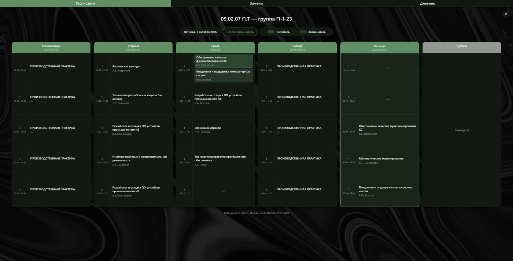
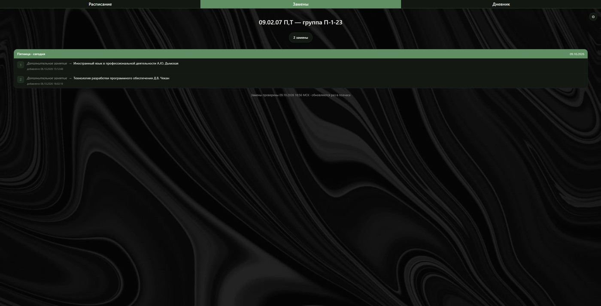
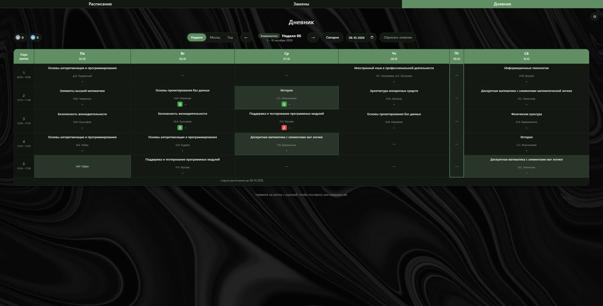
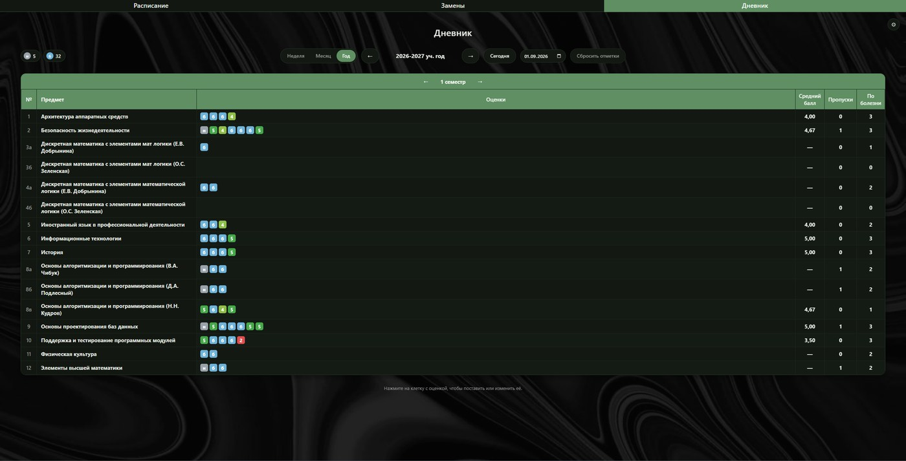
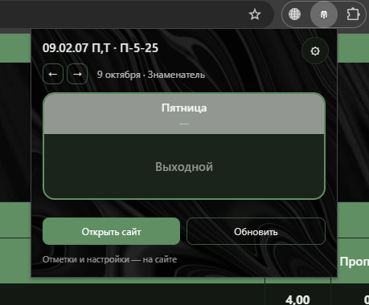
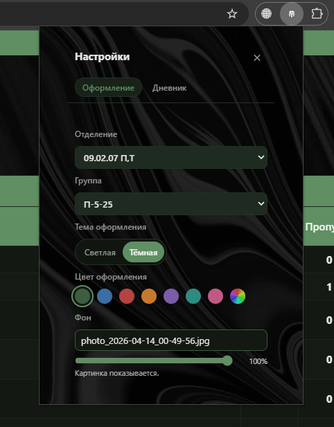

# Расписание, замены и дневник МПТ

Статический сайт для студентов Московского приборостроительного техникума:
расписание занятий, замены и дневник с отметками. Без сборки, без сервера,
без установки — открывается двойным щелчком по `index.html`.

## Как пользоваться

1. Скачать готовый архив: [раздел «Releases»](https://github.com/Jovelsk/raspisanie/releases) →
   последняя версия → `mpt-raspisanie-….zip`. Там же лежит архив исходников для
   разработчиков и `git clone`.
2. Распаковать целиком — структуру папок ломать нельзя.
3. Открыть `index.html`.

Данные подтягиваются сами: страница при первом открытии сходит на mpt.ru,
разберёт расписание и замены и запомнит их в браузере. Дальше она проверяет
замены раз в 30 минут и расписание раз в 12 часов, пока вкладка открыта.
Ни Node, ни установки, ни настройки для этого не нужны.

Свою группу выбирают шестерёнкой в правом верхнем углу: сначала отделение,
потом группу. Выбор запоминается.

## Что умеет

**Расписание.** Дни недели с корпусами, пары с преподавателями, деление на
числитель и знаменатель. Отделения и группы — как на сайте техникума.

**Замены.** Замены выбранной группы: что меняют, на что и когда добавили.
Отмена, дополнительное занятие и перенос помечаются отдельно.

**Дневник.** Отметки за пары — их может быть несколько на одну пару, средний
балл, пропуски «н» и болезни «б». Отметки привязаны к группе: переключил
группу — видишь её отметки, чужие не мешаются. Есть неделя, месяц и год.

**Ручная правка расписания.** Если в расписании сайта что-то не так, можно
задать своё на нужный период — но только до первого снимка с сайта, дальше
расписание берётся только с mpt.ru.

**Свой фон.** Положите картинку в папку проекта, рядом с `index.html`, и впишите
её название в настройках, в разделе «Фон» — например `bg.jpg`. Ползунком рядом
задаётся, насколько сильно картинка видна сквозь страницу. Так же это работает и
в расширении: оно показывает файлы из своей папки, поэтому ни хранить картинку в
браузере, ни указывать полный путь не нужно. Карточки пар и меню остаются
плотными, поэтому текст читается при любом положении ползунка.

**Выгрузка и загрузка.** Дневник и правки хранятся в браузере. Кнопками
«Экспорт» и «Импорт» во вкладке «Дневник» их можно сохранить в файл и
перенести на другое устройство — вместе с историей расписания, чтобы на новом
устройстве прошлые недели не оказались показаны по нынешнему расписанию.

## Как это выглядит

| Расписание на неделю | Замены |
| --- | --- |
|  |  |

| Дневник: неделя | Дневник: итоги за год |
| --- | --- |
|  |  |

## Расширение для браузера

Кроме сайта есть расширение: по клику на значок открывается окошко с сегодняшним
днём, отметками и заменами. Оно ставится **из той же папки**, что и сайт:

1. `chrome://extensions` → включить «Режим разработчика».
2. «Загрузить распакованное расширение» → указать папку проекта.
3. Нажать на значок расширения на панели браузера.

В окошке: сегодняшний день из дневника, перемотка на вчера и завтра, отметки
прямо в карточке, замены на выбранный день, настройки (группа, тема, цвет, фон)
и кнопка «Открыть сайт».

| Окошко расширения | Его настройки |
| --- | --- |
|  |  |

**Про хранилище.** Если открывать сайт **из расширения** (кнопка «Открыть сайт»),
то у страницы и у окошка **одно общее хранилище**: отметки, поставленные на сайте,
сразу видны в окошке, и наоборот — переносить ничего не нужно. Своё хранилище
только у сайта, открытого **файлом с диска**: между ним и расширением дневник
переносится выгрузкой — «Экспорт» на одной стороне, «Импорт» на другой.

**Версии.** Готовые архивы — в разделе «Releases»:
[v2 — сайт и расширение](https://github.com/Jovelsk/raspisanie/releases/tag/v2.0)
и [v1 — только сайт](https://github.com/Jovelsk/raspisanie/releases/tag/v1.0).
Берите **одну версию целиком**: сайт из одной версии и расширение из другой не
сойдутся, у них разный код.

## Про данные

**Снимков расписания и замен в репозитории нет намеренно.** Каждый получает
своё: страница делает первый снимок сама при открытии. Так в открытом доступе
не оказываются ни ФИО преподавателей, ни списки групп, а у человека данные
всегда свои и свежие.

Данные лежат в браузере (`localStorage`), поэтому очистка данных браузера их
уносит — для этого и нужны «Экспорт» и «Импорт».

## Если нужны свежие файлы на диске (обычному человеку не нужно)

Обычному человеку этот раздел не нужен: страница обновляет данные сама, и
делать для этого не надо ничего. Файлы `data/*.js` бывают нужны, только если
вы хотите отдать папку вместе с данными или прогнать проверки.

Разово получить файлы:

```bash
npm run fetch-schedule
npm run fetch-replacements
```

Чтобы они и дальше обновлялись сами — Windows, один раз, без прав администратора:

```powershell
powershell -ExecutionPolicy Bypass -File tools\install-task.ps1
```

Задачи Планировщика будут обновлять `data\schedule.js` (раз в 12 часов) и
`data\replacements.js` (раз в 30 минут), пока вы вошли в систему. Убрать:

```powershell
powershell -ExecutionPolicy Bypass -File tools\install-task.ps1 -Uninstall
```

На macOS и Linux такого установщика нет: там файлы обновляют через `cron`
или просто запускают `npm run fetch-schedule` и `npm run fetch-replacements`,
когда это нужно.

## Проверки

```bash
npm install
npm test
```

Проверкам нужен файл `data/schedule.js` — один раз получите его:

```bash
npm run fetch-schedule
npm run fetch-replacements
```

`npm test` прогоняет 200 с лишним проверок: разбор страниц mpt.ru, страницы в
jsdom, дневник (отметки, история расписания, ручные периоды, выгрузка),
живое обновление и хранилище снимков. Проверок много потому, что от данных
зависит весь дневник: сломанный разбор не должен затирать то, что уже есть.

Для проверок нужен свежий Node: `jsdom` требует `^22.22.2 || ^24.15.0 || >=26`.
Самому сайту Node не нужен вообще.

## Состав

```
index.html            расписание
replacements.html     замены
diary.html            дневник
css/main.css          все стили
js/mpt-parse.js       разбор страниц mpt.ru (общий с Node-скриптами)
js/live.js            обновление данных прямо со страницы
js/data.js            выбранная группа, версии расписания, ручные периоды
js/schedule.js        отрисовка расписания
js/replacements.js    отрисовка замен
js/diary.js           дневник: отметки, статистика, выгрузка
js/diary-settings.js  настройки дневника
js/theme.js           тема, цвета, выбор отделения и группы
tools/                загрузка данных с mpt.ru и проверки
data/                 снимки с сайта (создаются сами, в репозитории их нет)
```

## Как это работает

Страница читает данные из `data/*.js` — обычных `<script>`, поэтому сайт
работает и при открытии через `file://`, где `fetch` к своим файлам
заблокирован. Если снимка нет, `js/live.js` берёт данные из служебного
ответа mpt.ru (он разрешает чтение с других источников), разбирает тем же
разбором, что и Node-скрипты, проверяет и запоминает.

Разбор лежит в одном файле `js/mpt-parse.js` на двоих: его подключает
страница и выполняет Node-загрузчик. Две копии разбора разъехались бы, а от
него зависят и расписание, и замены, и весь дневник.

## Лицензия

MIT: берите, меняйте, используйте в своих проектах — даже в закрытых.
Единственное условие — сохранить строчку об авторстве. Полный текст в файле
[LICENSE](LICENSE).
